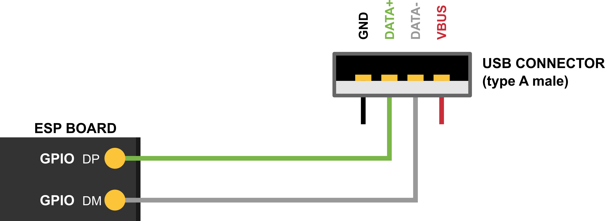
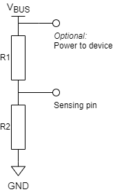

USB Device Stack
=================

{IDF_TARGET_USB_DP_GPIO_NUM:default="20", esp32h4="22", esp32p4="27"}
{IDF_TARGET_USB_DM_GPIO_NUM:default="19", esp32h4="21", esp32p4="26"}

Overview
--------

The ESP-IDF USB Device Stack (hereinafter referred to as the Device Stack) enables USB Device support on {IDF_TARGET_NAME}. By using the Device Stack, {IDF_TARGET_NAME} can be programmed with any well defined USB device functions (e.g., keyboard, mouse, camera), a custom function (aka vendor-specific class), or a combination of those functions (aka a composite device).

The Device Stack is built around the TinyUSB stack, but extends TinyUSB with some minor features and modifications for better integration with ESP-IDF. The Device stack is distributed as a managed component via the `ESP Component Registry <https://components.espressif.com/components/espressif/esp_tinyusb>`__.

Features
--------

.. list::

    .. only:: esp32p4

        - 1 USB High-Speed (USB 2.0) peripheral with internal PHY
            - Endpoint 0 and 15 additional endpoints configurable as IN or OUT
            - Up to 8 IN endpoints (including Endpoint 0) concurrently active.

    - 1 USB Full-Speed (USB 1.1) peripheral with internal PHY
        - Endpoint 0 and 6 additional endpoints configurable as IN or OUT
        - Up to 5 IN endpoints (including Endpoint 0) concurrently active.
    - Multiple supported device classes (CDC, HID, MIDI, MSC...)
    - Vendor specific class
    - Composite devices
    - VBUS monitoring for self-powered devices

.. Todo: Refactor USB hardware connect into a separate guide

Hardware Connection
-------------------

.. only:: esp32p4

    The {IDF_TARGET_NAME} routes the **USB 2.0 peripheral** D+ and D- signals to their dedicated pins. For USB device functionality, these pins must be connected to the bus (e.g., via a Micro-B port, USB-C port, or directly to standard-A plug).

The {IDF_TARGET_NAME} routes the **USB 1.1 peripheral** D+ and D- signals to GPIOs {IDF_TARGET_USB_DP_GPIO_NUM} and {IDF_TARGET_USB_DM_GPIO_NUM} respectively. For USB device functionality, these GPIOs must be connected to the bus (e.g., via a Micro-B port, USB-C port, or directly to standard-A plug).

.. only:: esp32s2 or esp32s3 or esp32h4

    .. note::

        If you are using an {IDF_TARGET_NAME} development board with two USB ports, the port labeled "USB" will already be connected to the D+ and D- GPIOs.

.. note::

    Self-powered devices must also connect VBUS through a voltage divider or comparator. For more details, please refer to :ref:`self-powered-device`.

.. only:: esp32s3

    External PHY Configuration
    --------------------------

    The {IDF_TARGET_NAME} contains two USB controllers: USB-OTG and USB-Serial-JTAG. However, both controllers share a **single PHY**, which means only one can operate at a time. To use USB Device functionality while the USB-Serial-JTAG is active (e.g., for debugging or flashing), an **external PHY** is required, since the PHY is used by USB-Serial-JTAG.

    .. note::
        An external PHY is not the only way to enable debugging alongside USB Host or Device functionality. It is also possible to switch the debugging interface from USB-Serial-JTAG to plain JTAG by burning the appropriate eFuses. For details, refer to document `JTAG Debugging <https://docs.espressif.com/projects/esp-idf/en/stable/{IDF_TARGET_PATH_NAME}/api-guides/jtag-debugging/index.html>`__ in ESP-IDF Programming Guide for your target.

    {IDF_TARGET_NAME} supports connecting external PHY ICs. This becomes especially relevant when full-speed USB device functionality is needed while the USB-Serial-JTAG controller is also in use. Various external PHY ICs may require different hardware modifications. Please refer to each IC's datasheet for specifics. A general connection diagram below is provided for reference. For more information, please refer to `Use an external PHY <https://docs.espressif.com/projects/esp-iot-solution/en/latest/usb/usb_overview/usb_phy.html#use-an-external-phy>`__.

    .. figure:: ../_static/usb_device/usb_fs_phy_sp5301.png
       :align: center
       :alt: usb_fs_phy_sp5301

       A typical circuit diagram for an external PHY

    **List of Tested External PHY ICs:**

    - **SP5301** — Directly supported by {IDF_TARGET_NAME}. See the guide above for schematic and routing information.
    - **TUSB1106** — Directly supported by {IDF_TARGET_NAME}. Works with the external-PHY driver via GPIO mapping. Follow the reference wiring in the TUSB1106 datasheet (power-supply options and recommended series resistors on D+/D–).
    - **STUSB03E** — Requires signal routing using an analog switch. See example below.

    .. figure:: ../_static/usb_device/ext_phy_schematic_stusb03e.png
       :align: center
       :alt: External PHY with Analog Switch Schematic (Device mode)

       Example connection using STUSB03E and analog switch (Device mode)

    .. note::
        This schematic is a minimal example intended only to demonstrate the external PHY connection. It omits other essential components and signals (e.g., VCC, GND, RESET) required for a complete, functional {IDF_TARGET_NAME} design.
        The schematic includes both a +5 V rail (usually from USB VBUS) and a VCC rail. VCC should match the chip supply voltage (usually 3.3 V). Ensure that the external PHY and the chip are powered from the same voltage domain. If designing a self-powered USB device, connect VBUSDET signal from the external PHY to {IDF_TARGET_NAME} for mandatory VBUS monitoring.

    Hardware configuration is handled via GPIO mapping to the PHY's pins. Any unused pins (e.g., :cpp:member:`usb_phy_ext_io_conf_t::suspend_n_io_num`, :cpp:member:`usb_phy_ext_io_conf_t::fs_edge_sel_io_num`) **must be set to -1**.

    .. note::
        The :cpp:member:`usb_phy_ext_io_conf_t::suspend_n_io_num` pin is **currently not supported** and does not need to be connected.
        The :cpp:member:`usb_phy_ext_io_conf_t::fs_edge_sel_io_num` pin is optional and only required if switching between low-speed and full-speed modes is needed.

    Starting from version 2.0, the ESP TinyUSB Device Stack supports external PHY usage. To use an external PHY in device mode:

    1. Configure the GPIO mapping and PHY using :cpp:type:`usb_phy_config_t`.
    2. Create the PHY using :cpp:func:`usb_new_phy()`.
    3. Use :cpp:func:`TINYUSB_DEFAULT_CONFIG()` to initialize :cpp:type:`tinyusb_config_t`.
    4. Set the `phy.skip_setup` field of :cpp:type:`tinyusb_config_t` to ``true`` to bypass PHY reinitialization and use the externally configured PHY.

    **Example Code:**

    .. code-block:: c

        // GPIO configuration for external PHY
        const usb_phy_ext_io_conf_t ext_io_conf = {
            .vp_io_num  = 8,
            .vm_io_num  = 5,
            .rcv_io_num = 11,
            .oen_io_num = 17,
            .vpo_io_num = 4,
            .vmo_io_num = 46,
            .suspend_n_io_num = -1,
            .fs_edge_sel_io_num = -1,
        };

        // Configuration and initialization of external PHY for OTG controller (Device mode)
        const usb_phy_config_t phy_config = {
            .controller = USB_PHY_CTRL_OTG,
            .target = USB_PHY_TARGET_EXT,
            .otg_mode = USB_OTG_MODE_DEVICE,
            .otg_speed = USB_PHY_SPEED_FULL,
            .ext_io_conf = &ext_io_conf
        };

        usb_phy_handle_t phy_hdl;
        ESP_ERROR_CHECK(usb_new_phy(&phy_config, &phy_hdl));

        // Initialize TinyUSB with default configuration (event handler can be set if needed)
        tinyusb_config_t config = TINYUSB_DEFAULT_CONFIG();
        config.phy.skip_setup = true;

        tinyusb_driver_install(&config);

    This setup ensures that the USB Device stack uses the **external PHY** instead of attempting to configure the internal one.

Device Stack Structure
----------------------

The basis of the Device Stack is TinyUSB, where the Device Stack implements the following features on top of TinyUSB:

- Customization of USB descriptors
- Serial device support
- Redirecting of standard streams through the Serial device
- Storage Media (SPI-Flash and SD-Card) for USB Device MSC Class.
- A task within the encapsulated device stack that handles TinyUSB servicing

Component Dependency
^^^^^^^^^^^^^^^^^^^^

The Device Stack is distributed via the `ESP Component Registry <https://components.espressif.com/components/espressif/esp_tinyusb>`__. Thus, to use it, please add the Device Stack component as dependency using the following command:

.. code:: bash

    idf.py add-dependency esp_tinyusb

Configuration Options
^^^^^^^^^^^^^^^^^^^^^

Multiple aspects of the Device Stack can be configured using menuconfig. These include:

- The verbosity of the TinyUSB's log
- Device Stack task related options
- Default device/string descriptor options
- Class specific options

The generated Kconfig reference for the available ``CONFIG_TINYUSB_*`` options is provided at the end of this document.

.. _descriptors-configuration:

Descriptor Configuration
^^^^^^^^^^^^^^^^^^^^^^^^

The :cpp:type:`tinyusb_config_t` structure exposes USB descriptor settings through :cpp:member:`tinyusb_config_t::descriptor`, which is a :cpp:type:`tinyusb_desc_config_t`.

The following descriptors should be initialized for both full-speed and high-speed devices:

- :cpp:member:`tinyusb_desc_config_t::device`
- :cpp:member:`tinyusb_desc_config_t::string`

Full-speed devices should initialize the following field to provide their configuration descriptor:

- :cpp:member:`tinyusb_desc_config_t::full_speed_config`

.. only:: esp32p4

    High-speed devices should initialize the following fields to provide configuration descriptors at each speed:

    - :cpp:member:`tinyusb_desc_config_t::full_speed_config`
    - :cpp:member:`tinyusb_desc_config_t::high_speed_config`
    - :cpp:member:`tinyusb_desc_config_t::qualifier`

    .. note::

        Both :cpp:member:`tinyusb_desc_config_t::full_speed_config` and :cpp:member:`tinyusb_desc_config_t::high_speed_config` must be present to comply with the USB 2.0 specification.

The Device Stack will instantiate a USB device based on the descriptors provided in the fields described above when :cpp:func:`tinyusb_driver_install` is called.

The Device Stack also provides default descriptors when the corresponding fields in :cpp:type:`tinyusb_desc_config_t` are set to ``NULL``. Their values come from menuconfig options such as ``CONFIG_TINYUSB_DESC_*``. Default descriptors include:

- Default device descriptor: set :cpp:member:`tinyusb_desc_config_t::device` to ``NULL``.
- Default string descriptor: set :cpp:member:`tinyusb_desc_config_t::string` to ``NULL``.
- Default qualifier descriptor: set :cpp:member:`tinyusb_desc_config_t::qualifier` to ``NULL`` on high-speed-capable devices.
- Default configuration descriptors. Some classes that rarely require custom configuration (such as CDC, MSC, and NCM) provide default configuration descriptors. These can be enabled by setting the associated field to ``NULL``:

    - :cpp:member:`tinyusb_desc_config_t::full_speed_config`: full-speed descriptor
    - :cpp:member:`tinyusb_desc_config_t::high_speed_config`: high-speed descriptor on high-speed-capable devices

Installation
------------

To install the Device Stack, please call :cpp:func:`tinyusb_driver_install`. The Device Stack's configuration is specified in a :cpp:type:`tinyusb_config_t` structure that is passed as an argument to :cpp:func:`tinyusb_driver_install`.

.. note::

    Initialize :cpp:type:`tinyusb_config_t` with ``TINYUSB_DEFAULT_CONFIG()`` and then override only the fields you need. Descriptor pointers left as ``NULL`` use the default descriptor values when available.

.. code-block:: c

    #include "tinyusb_default_config.h"

    tinyusb_config_t tusb_cfg = TINYUSB_DEFAULT_CONFIG();
    tusb_cfg.descriptor.device = NULL;
    tusb_cfg.descriptor.string = NULL;
    tusb_cfg.descriptor.full_speed_config = NULL;
    #if (SOC_USB_OTG_PERIPH_NUM > 1)
        tusb_cfg.descriptor.high_speed_config = NULL;
        tusb_cfg.descriptor.qualifier = NULL;
    #endif

    ESP_ERROR_CHECK(tinyusb_driver_install(&tusb_cfg));

.. _self-powered-device:

Self-Powered Device
-------------------

USB specification mandates self-powered devices to monitor voltage levels on USB's VBUS signal. As opposed to bus-powered devices, a self-powered device can be fully functional even without a USB connection. The self-powered device detects connection and disconnection events by monitoring the VBUS voltage level. VBUS is considered valid if it rises above 4.75 V and invalid if it falls below 4.35 V.

On the {IDF_TARGET_NAME}, this will require using a GPIO to act as a voltage sensing pin to detect when VBUS goes above/below the prescribed thresholds. However, {IDF_TARGET_NAME} pins are 3.3 V tolerant. Thus, even if VBUS rises/falls above/below the thresholds mentioned above, it would still appear as a logic HIGH to the {IDF_TARGET_NAME}. Thus, in order to detect the VBUS valid condition, users can do one of the following:

- Connect VBUS to a voltage comparator chip/circuit that detects the thresholds described above (i.e., 4.35 V and 4.75 V), and outputs a 3.3 V logic level to the {IDF_TARGET_NAME} indicating whether VBUS is valid or not.
- Use a resistor voltage divider that outputs (0.75 x Vdd) if VBUS is 4.4 V (see figure below).

.. note::

    In either case, the voltage on the sensing pin must be logic low within 3 ms after the device is unplugged from the USB host.

    Simple voltage divider for VBUS monitoring

To use this feature, set :cpp:member:`tinyusb_phy_config_t::self_powered` to ``true`` and :cpp:member:`tinyusb_phy_config_t::vbus_monitor_io` to the GPIO used for VBUS monitoring through :cpp:member:`tinyusb_config_t::phy`.

USB Serial Device (CDC-ACM)
---------------------------

If :ref:`CONFIG_TINYUSB_CDC_ENABLED` is enabled in menuconfig, the USB Serial Device can be initialized with :cpp:func:`tinyusb_cdcacm_init` according to the settings from :cpp:type:`tinyusb_config_cdcacm_t`, see the example below.

.. code-block:: c

    const tinyusb_config_cdcacm_t acm_cfg = {
        .cdc_port = TINYUSB_CDC_ACM_0,
        .callback_rx = NULL,
        .callback_rx_wanted_char = NULL,
        .callback_line_state_changed = NULL,
        .callback_line_coding_changed = NULL
    };
    ESP_ERROR_CHECK(tinyusb_cdcacm_init(&acm_cfg));

To specify callbacks, you can either set the pointer to your :cpp:type:`tusb_cdcacm_callback_t` function in the configuration structure or call :cpp:func:`tinyusb_cdcacm_register_callback` after initialization.

USB Serial Console
^^^^^^^^^^^^^^^^^^

The USB Serial Device allows the redirection of all standard input/output streams (stdin, stdout, stderr) to USB. Thus, calling standard library input/output functions such as ``printf()`` will result into the data being sent/received over USB instead of UART.

Users should call :cpp:func:`tinyusb_console_init` with the CDC interface number to switch the standard input/output streams to USB, and :cpp:func:`tinyusb_console_deinit` to switch them back to UART.

USB Mass Storage Device (MSC)
-----------------------------

If :ref:`CONFIG_TINYUSB_MSC_ENABLED` is enabled in menuconfig, the ESP chip can be used as a USB MSC device. The storage media (SPI flash or SD card) can be initialized as shown below.

- SPI-Flash

.. code-block:: c

    static esp_err_t storage_init_spiflash(wl_handle_t *wl_handle)
    {
        ***
        esp_partition_t *data_partition = esp_partition_find_first(ESP_PARTITION_TYPE_DATA, ESP_PARTITION_SUBTYPE_DATA_FAT, NULL);
        ***
        wl_mount(data_partition, wl_handle);
        ***
    }
    storage_init_spiflash(&wl_handle);

    tinyusb_msc_storage_handle_t storage_hdl;
    const tinyusb_msc_storage_config_t config_spi = {
        .medium.wl_handle = wl_handle,
    };
    ESP_ERROR_CHECK(tinyusb_msc_new_storage_spiflash(&config_spi, &storage_hdl));

- SD-Card

.. code-block:: c

    static esp_err_t storage_init_sdmmc(sdmmc_card_t **card)
    {
        ***
        sdmmc_host_t host = SDMMC_HOST_DEFAULT();
        sdmmc_slot_config_t slot_config = SDMMC_SLOT_CONFIG_DEFAULT();
        // For SD Card, set bus width to use

        slot_config.width = 4;
        slot_config.clk = CONFIG_EXAMPLE_PIN_CLK;
        slot_config.cmd = CONFIG_EXAMPLE_PIN_CMD;
        slot_config.d0 = CONFIG_EXAMPLE_PIN_D0;
        slot_config.d1 = CONFIG_EXAMPLE_PIN_D1;
        slot_config.d2 = CONFIG_EXAMPLE_PIN_D2;
        slot_config.d3 = CONFIG_EXAMPLE_PIN_D3;
        slot_config.flags |= SDMMC_SLOT_FLAG_INTERNAL_PULLUP;

        *card = calloc(1, sizeof(sdmmc_card_t));
        ESP_ERROR_CHECK(sdmmc_host_init());
        ESP_ERROR_CHECK(sdmmc_host_init_slot(host.slot, &slot_config));
        ESP_ERROR_CHECK(sdmmc_card_init(&host, *card));
        ***
    }
    sdmmc_card_t *card = NULL;
    storage_init_sdmmc(&card);

    tinyusb_msc_storage_handle_t storage_hdl;
    const tinyusb_msc_storage_config_t config_sdmmc = {
        .medium.card = card,
    };
    ESP_ERROR_CHECK(tinyusb_msc_new_storage_sdmmc(&config_sdmmc, &storage_hdl));

MSC Performance Optimization
^^^^^^^^^^^^^^^^^^^^^^^^^^^^

**Single-Buffer Approach**

The single-buffer approach improves performance by using a dedicated buffer to temporarily store incoming write data instead of processing it immediately in the callback.

- **Configurable buffer size**: The buffer size is set via :ref:`CONFIG_TINYUSB_MSC_BUFSIZE`, allowing users to balance performance and memory usage.

This approach ensures that USB transactions remain fast while avoiding potential delays caused by storage operations.

**USB MSC Drive Performance**

.. only:: esp32s3

    .. list-table::
        :header-rows: 1
        :widths: 20 20 20

        * - FIFO Size
          - Read Speed
          - Write Speed

        * - 512 B
          - 0.566 MB/s
          - 0.236 MB/s

        * - 8192 B
          - 0.925 MB/s
          - 0.928 MB/s

.. only:: esp32p4

    .. list-table::
        :header-rows: 1
        :widths: 20 20 20

        * - FIFO Size
          - Read Speed
          - Write Speed

        * - 512 B
          - 1.174 MB/s
          - 0.238 MB/s

        * - 8192 B
          - 4.744 MB/s
          - 2.157 MB/s

        * - 32768 B
          - 5.998 MB/s
          - 4.485 MB/s

.. only:: esp32s2

    .. note::

        SD card support is not available for {IDF_TARGET_NAME} in MSC device mode.

    **SPI Flash Performance:**

    .. list-table::
        :header-rows: 1
        :widths: 20 20

        * - FIFO Size
          - Write Speed

        * - 512 B
          - 5.59 KB/s

        * - 8192 B
          - 21.54 KB/s

.. only:: esp32h4

    .. note::

        SD card support is not available for {IDF_TARGET_NAME} in MSC device mode.

    **SPI Flash Performance:**

    .. list-table::
        :header-rows: 1
        :widths: 20 20

        * - FIFO Size
          - Write Speed

        * - 512 B
          - 4.48 KB/s

        * - 8192 B
          - 22.33 KB/s

Performance Limitations:

- **Internal SPI Flash performance** is constrained by architectural limitations where program execution and storage access share the same flash chip. This results in program execution being **suspended during flash writes**, significantly impacting performance.
- **Internal SPI Flash usage is intended primarily for demonstration purposes.** For practical use cases requiring higher performance, it is recommended to use **external storage such as an SD card or an external SPI flash chip, where supported.**

.. only:: esp32s3 or esp32p4

    SD cards are not affected by this constraint, explaining their higher performance gains.

Application Examples
--------------------

For better visibility, the examples can be found in ESP-IDF's GitHub repository in the directory `peripherals/usb/device <https://github.com/espressif/esp-idf/tree/master/examples/peripherals/usb/device>`__.

- `tusb_console <https://github.com/espressif/esp-idf/tree/master/examples/peripherals/usb/device/tusb_console>`__ demonstrates how to set up {IDF_TARGET_NAME} to get log output via a Serial Device connection using the TinyUSB component, applicable for any Espressif boards that support USB-OTG.
- `tusb_serial_device <https://github.com/espressif/esp-idf/tree/master/examples/peripherals/usb/device/tusb_serial_device>`__ demonstrates how to set up {IDF_TARGET_NAME} to function as a USB Serial Device using the TinyUSB component, with the ability to be configured as a double serial device.
- `tusb_midi <https://github.com/espressif/esp-idf/tree/master/examples/peripherals/usb/device/tusb_midi>`__ demonstrates how to set up {IDF_TARGET_NAME} to function as a USB MIDI Device, outputting a MIDI note sequence via the native USB port using the TinyUSB component.
- `tusb_hid <https://github.com/espressif/esp-idf/tree/master/examples/peripherals/usb/device/tusb_hid>`__ demonstrates how to implement a USB keyboard and mouse using the TinyUSB component, which sends 'key a/A pressed & released' events and moves the mouse in a square trajectory upon connection to a USB host.
- `tusb_msc <https://github.com/espressif/esp-idf/tree/master/examples/peripherals/usb/device/tusb_msc>`__ demonstrates how to use the USB capabilities to create a Mass Storage Device that can be recognized by USB-hosts, allowing access to its internal data storage, with support for SPI Flash and SD MMC Card storage media.
- `tusb_composite_msc_serialdevice <https://github.com/espressif/esp-idf/tree/master/examples/peripherals/usb/device/tusb_composite_msc_serialdevice>`__ demonstrates how to set up {IDF_TARGET_NAME} to function simultaneously as both a USB Serial Device and an MSC device (SPI-Flash as the storage media) using the TinyUSB component.

.. only:: not esp32p4 and not esp32h4

  - `tusb_ncm <https://github.com/espressif/esp-idf/tree/master/examples/peripherals/usb/device/tusb_ncm>`__ demonstrates how to transmit Wi-Fi data to a Linux or Windows host via USB using the Network Control Model (NCM), a sub-class of Communication Device Class (CDC) USB Device for Ethernet-over-USB applications, with the help of a TinyUSB component.

API Reference
-------------

.. include-build-file:: inc/tinyusb.inc

.. include-build-file:: inc/tinyusb_default_config.inc

.. include-build-file:: inc/tinyusb_cdc_acm.inc

.. include-build-file:: inc/tinyusb_console.inc

.. include-build-file:: inc/tinyusb_msc.inc

.. include-build-file:: inc/tinyusb_net.inc

.. include-build-file:: inc/vfs_tinyusb.inc

Kconfig Reference
-----------------

The generated Kconfig reference below documents the available ``CONFIG_TINYUSB_*`` options for esp_tinyusb, including descriptor defaults and class-specific settings.

.. include-build-file:: inc/usb_device_kconfig.inc
