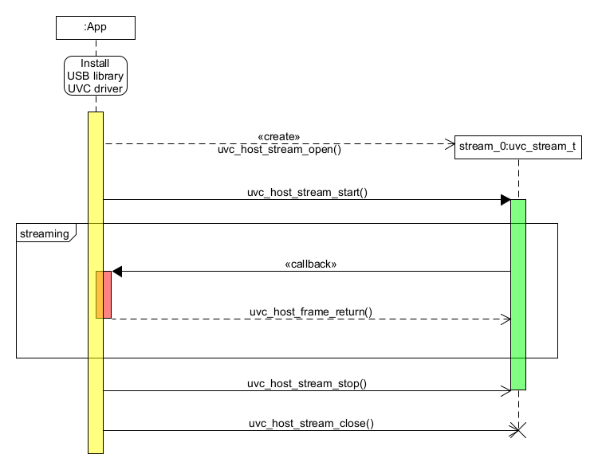

# USB Host UVC Class Driver

This component contains an implementation of a USB Host UVC Class Driver that is implemented on top of the [USB Host Library](https://docs.espressif.com/projects/esp-idf/en/latest/esp32s2/api-reference/peripherals/usb_host.html).

The UVC driver allows video streaming from USB cameras.

### Features
- Isochronous and Bulk transfers streaming
- Multiple video streams
- Frame buffers in PSRAM
- Video Stream format negotiation
- Stream overflow and underflow management
- Dynamic resolution change

### Usage

Following sequence diagram represents public API usage of the UVC driver. New frames are passed to user in a callback. This design offers flexible interface upon which more complex frame processing components can be built.

### Additional information
- [Frequently Asked Questions](docs/FAQ.md)
- [Examples](examples/)
- [Architectural notes](docs/arch_notes.md)
