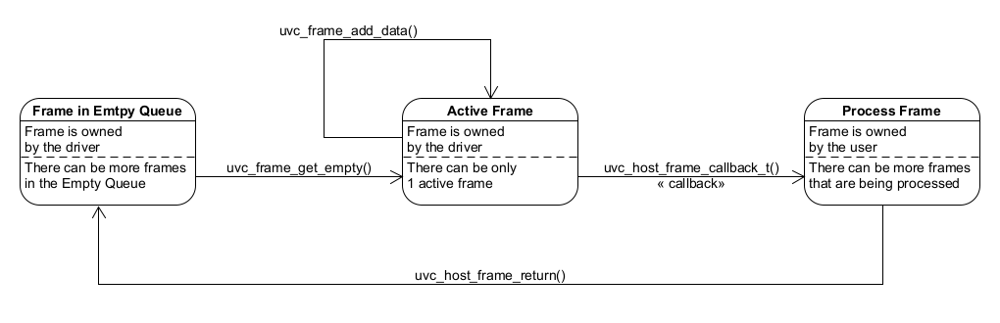

## Architectural Notes

This driver utilizes two distinct types of memory buffers, both of which can be configured per UVC stream during stream initialization via the `uvc_host_stream_config_t.advanced` structure. The buffer types are as follows:

### 1. URB (USB Request Block)
- **Definition:** Provided by the USB Host Library in ESP-IDF.
- **Ownership:** Managed by the USB Host Library.
- **Placement:** Determined by ESP-IDF settings (internal or external RAM).
- **Purpose:** Transfers raw data from the USB device to the ESP host.
- **Behavior:**
  - The driver continuously resubmits the URB until streaming stops.
  - After submission, the CPU is interrupted when the URB is completed.
  - The buffer size impacts interrupt frequency—larger buffers result in fewer interrupts.
- **Recommendation:** Use triple buffering for optimal performance:
  - One buffer is processed by the driver.
  - One buffer is actively transferring data.
  - One buffer is queued for submission.
- **Driver Role:** Processes data from the URB and reconstructs video frames.

### 2. FB (Frame Buffer)
- **Definition:** Custom buffer type defined within this driver.
- **Ownership:** Dynamic ownership:
  - Empty FBs are owned by the driver.
  - Once a full frame is reconstructed and stored in the FB, it is passed to the user via `uvc_host_frame_callback_t`.
  - After processing the frame, the user must return the FB to the driver, either by:
    - Returning `true` from the callback, or
    - Explicitly calling `uvc_host_frame_return()`.
- **Recommendation:** Use triple buffering for optimal performance:
  - One buffer is used for frame reconstruction.
  - One buffer is processed by the user.
  - One buffer is queued for use.
- **Frame Size Considerations:**
  - UVC cameras report the maximum frame buffer size during stream format negotiation.
  - These sizes are often overly large, leading to inefficient RAM usage.
  - This driver allows the allocation of smaller FBs to optimize memory usage.

### Frame buffer state transitions

